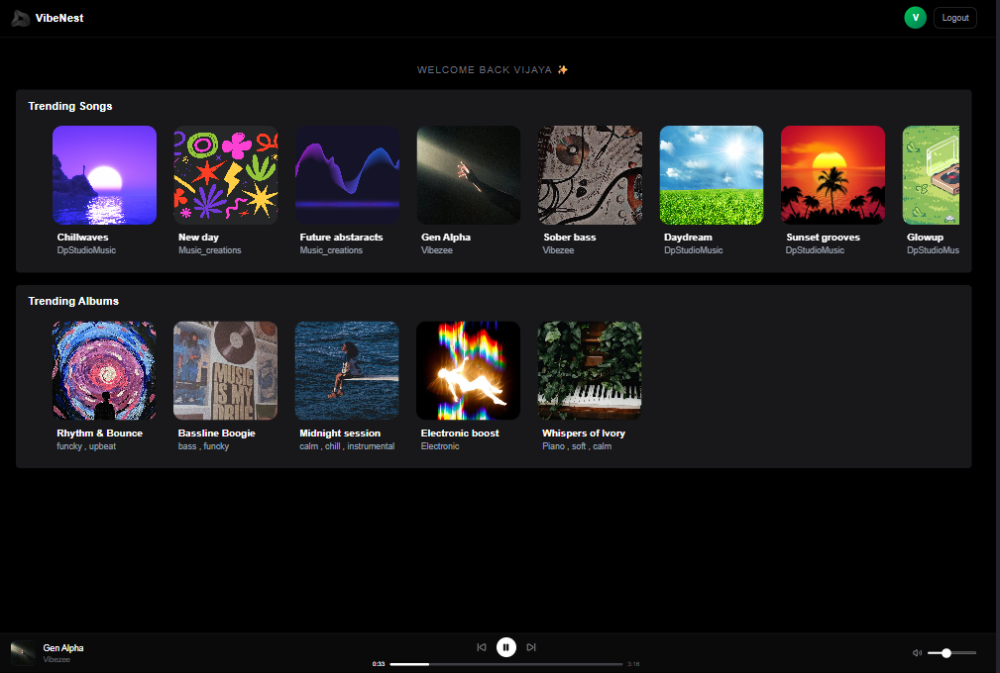
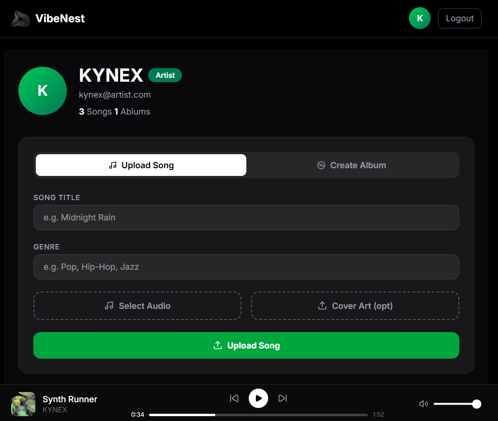
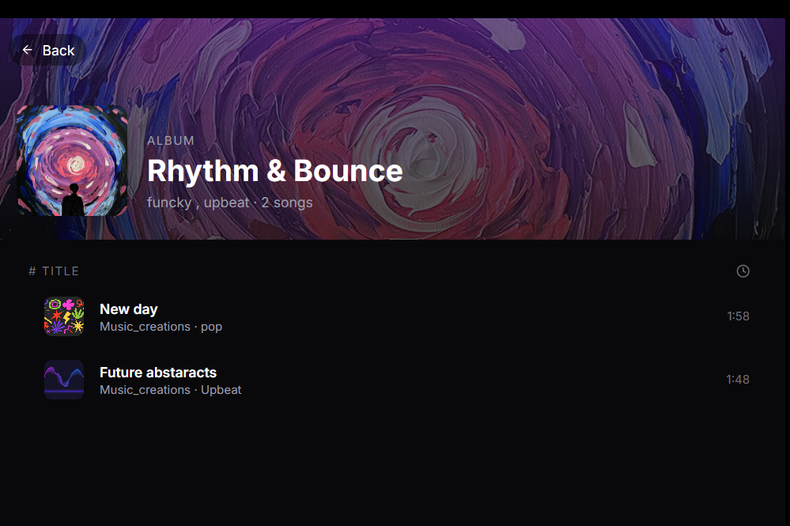
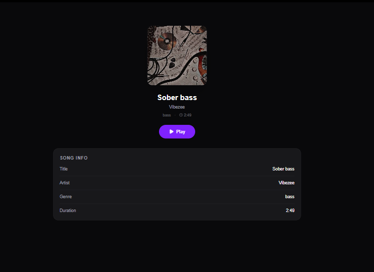

# 🎵 VibeNest

A full-stack music streaming web app where artists upload their music and listeners discover it. Think SoundCloud-style — no Spotify API, everything is self-hosted via Cloudinary.

**Live Demo:** [your-vercel-url.vercel.app](https://your-vercel-url.vercel.app) &nbsp;|&nbsp; **Backend:** [your-render-url.onrender.com](https://your-render-url.onrender.com)

---

## Features

**For Listeners**
- Browse trending songs and albums on the home feed
- Click any song to view details and play it
- Persistent bottom audio player with prev/next controls and volume
- Profile page showing total songs and albums available

**For Artists**
- Upload songs with title, genre, cover art, and audio file
- Create albums and add your songs to them
- Dashboard showing your uploaded songs and albums with delete option

**Auth**
- Register and login with role selection (Artist or Listener)
- JWT-based authentication with protected routes

---

## Tech Stack

| Layer | Tech |
|---|---|
| Frontend | React, React Router, Tailwind CSS |
| Backend | Node.js, Express.js |
| Database | MongoDB, Mongoose |
| Storage | Cloudinary (audio + images) |
| Auth | JWT, bcrypt |
| Deploy | Vercel (frontend) + Render (backend) |

---

## Folder Structure

```
vibenest/
├── backend/
│   ├── controllers/
│   ├── middleware/
│   ├── models/
│   ├── routes/
│   └── server.js
├── frontend/
│   ├── public/
│   └── src/
│       ├── components/
│       ├── pages/
│       ├── context/
│       └── main.jsx
```

---

## Getting Started

### Prerequisites
- Node.js v18+
- MongoDB Atlas account
- Cloudinary account

### Backend Setup

```bash
cd backend
npm install
```

Create a `.env` file in the `backend/` folder:

```env
MONGO_URI=your_mongodb_connection_string
JWT_SECRET=your_jwt_secret
CLOUDINARY_CLOUD_NAME=your_cloud_name
CLOUDINARY_API_KEY=your_api_key
CLOUDINARY_API_SECRET=your_api_secret
```

```bash
npm run dev
```

### Frontend Setup

```bash
cd frontend
npm install
npm run dev
```

> Make sure the frontend's API base URL points to your backend. Update it in your axios config or `.env` if you've set it up.

---

## Deployment

**Backend → Render**
- Create a new Web Service on Render
- Connect your GitHub repo, set root directory to `backend`
- Add all environment variables from `.env`
- Build command: `npm install` | Start command: `node server.js`

**Frontend → Vercel**
- Import the repo on Vercel
- Set root directory to `frontend`
- Add any frontend env variables if needed
- Vercel auto-detects Vite/React and handles the build

---

## Screenshots

| Home Feed | Artist Dashboard |
|---|---|
|  |  |

| Album Page | Song Detail |
|---|---|
|  |  |

---

## Author

**Vijaya** — Self-taught MERN stack developer

[GitHub](https://github.com/your-username) · [LinkedIn](https://linkedin.com/in/your-username)